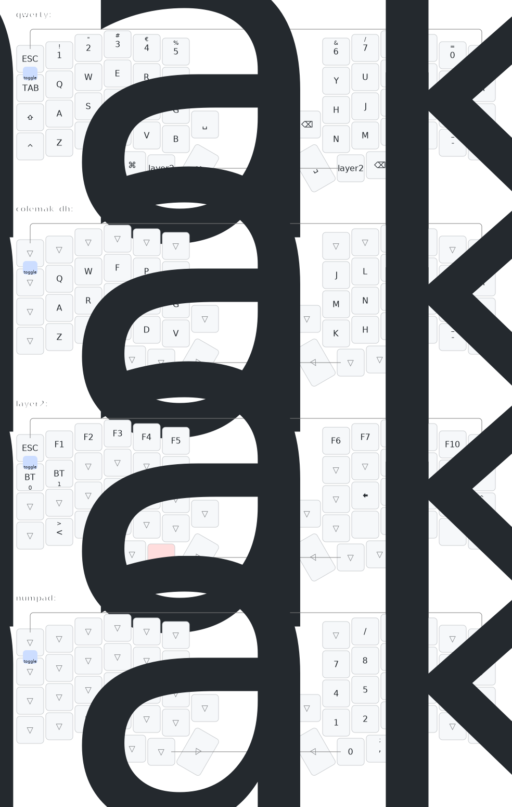

# Viktor's Lily58 Qwerty Swedish

ZMK config for my Lily58 keyboard.

## Spec:
- 99% Mac
- I'm a decent qwerty+se typer and I'm trying to not reset my muscle memory entirely for now. I have plans on going Colemak DH and change out symbols to something better, but for now I'm sticking with something as close to what I'm used to from Swedish Mac layout - which is actually pretty far from even swedish Windows for symbols in many ways.
- I'm using Swedish locale in OS so the hardware codes are adapted for that. So the chart below is representing what I have _after_ software.

## Workflow
To understand what hardware codes actually represent what I get in my locale and what's actually printed on my swedish keyboards, I'm using karabiner eventviewer. So to configure a key that's not straightforward, I press it, see what I get in karabiner eventviewer and then try to look it up in zmk codes. For instance, the key for '<' and '>' is to the left of z on a swedish keyboard.

So I press it, see what the hardware code is in eventviewer:

And then I look it up on https://zmk.dev/docs/codes:

In my lily layout, I don't have room for this key so I' gonna put it on the second layer for z and x. So that is:

    &kp GRAVE     &kp LS(GRAVE)

## Layout

## TODO
- [x] match shift, ctrl, alt, option as I'm used to
- [x] Backspace in normal upper right
- [x] å ä ö 
- [x] arrows
- [x] remove backspace on thumb
- [x] keep shift on left on raise layer
- [x] add quote and question mark to raise
- [x] escape not working? hardware, bent pin
- [x] Lock key
- [x] switch layer key and space!
- [x] Think about how I want symbol layers
- [x] look into https://github.com/minusfive/zmk-config
- [ ] home row mods?

# Old
## Issues
- [x] I'm having problems with the bootloader I think. NiceNano clones from https://www.aliexpress.com/item/1005006076173222.html?spm=a2g0o.order_list.order_list_main.119.4e981802ffEh3T

    On my MacStudio I could never get it up as an USB flash drive, it just disconnects straight after double tapping reset. On the MacBook Air I actually did flash it _a couple_ of times by simply dragging to the usb drive, but now I can't seem to do it anymore.
  
    Should I update the bootloader?
      
      UF2 Bootloader 0.6.0 lib/nrfx (v2.0.0) lib/tinyusb (0.10.1-41-gdf0cda2d) lib/uf2 (remotes/origin/configupdate-9-gadbb8c7)
      Model: nice!nano
      Board-ID: nRF52840-nicenano
      SoftDevice: S140 version 6.1.1
      Date: Jun 19 2021

    I think I just did from https://github.com/adafruit/Adafruit_nRF52_Bootloader/releases:

      UF2 Bootloader 0.8.0 lib/nrfx (v2.0.0) lib/tinyusb (0.12.0-145-g9775e7691) lib/uf2 (remotes/origin/configupdate-9-gadbb8c7)
      Model: nice!nano
      Board-ID: nRF52840-nicenano
      Date: Sep 29 2023
      SoftDevice: S140 6.1.1

### On the MacBook Air

But when dragging a file over, three things happens at once:

and no update is done :(

## Karabiner EventViewer
Use Karabiner EventViewer to find keycodes of everything I'm used to from another keyboard as well as this one while iterating keymaps

## Lock cmd:
This is the lock combo as programmed on logitech keyboard:

    [
      {
        "type": "down",
        "name": {"key_code":"left_command"},
        "usagePage": "7 (0x0007)",
        "usage": "227 (0x00e3)",
        "misc": "flags left_command"
      },
      {
        "type": "down",
        "name": {"key_code":"left_control"},
        "usagePage": "7 (0x0007)",
        "usage": "224 (0x00e0)",
        "misc": "flags left_command,left_control"
      },
      {
        "type": "down",
        "name": {"key_code":"q"},
        "usagePage": "7 (0x0007)",
        "usage": "20 (0x0014)",
        "misc": "flags left_command,left_control"
      },
      {
        "type": "up",
        "name": {"key_code":"q"},
        "usagePage": "7 (0x0007)",
        "usage": "20 (0x0014)",
        "misc": "flags left_command,left_control"
      },
      {
        "type": "up",
        "name": {"key_code":"left_control"},
        "usagePage": "7 (0x0007)",
        "usage": "224 (0x00e0)",
        "misc": "flags left_command"
      },
      {
        "type": "up",
        "name": {"key_code":"left_command"},
        "usagePage": "7 (0x0007)",
        "usage": "227 (0x00e3)",
        "misc": ""
      },
    